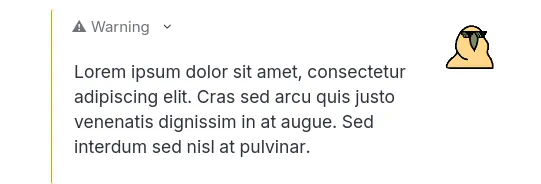
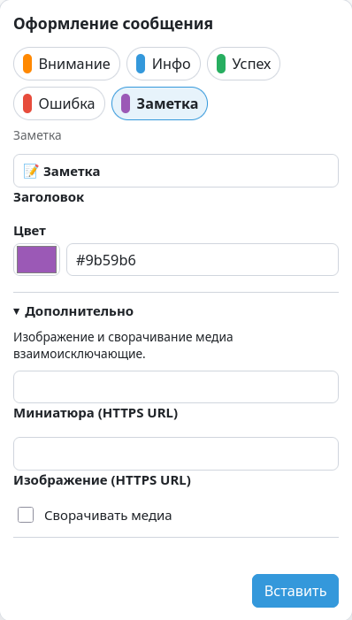

# Rocket.Chat Markdown+

Color-coded warnings, notes, and status blocks for the Rocket.Chat web client.

[**Install userscript**](https://raw.githubusercontent.com/vgy789/rocket-chat-markdown-plus/main/dist/rocket-chat-markdown-plus.user.js)
· [Syntax](./docs/SYNTAX.md) · [Русский](./README.md)

<table>
  <tr>
    <td></td>
    <td></td>
  </tr>
</table>

## Install

1. Install [Tampermonkey](https://www.tampermonkey.net/) in Chromium or Firefox.
2. Open the [**userscript**](https://raw.githubusercontent.com/vgy789/rocket-chat-markdown-plus/main/dist/rocket-chat-markdown-plus.user.js) and confirm installation.
3. Reload Rocket.Chat — a `::+` button will appear beside the composer.

### Chromium

Copy `chrome://extensions` into the address bar and open **Tampermonkey → Details**. Enable **Allow User Scripts**. If Tampermonkey was installed with **Load unpacked**, also enable **Developer mode** on the extensions page.

### Firefox

No additional setup is normally required.

If the button is missing, make sure Tampermonkey and `Rocket.Chat Markdown+` are enabled.

## Usage

Press `::+` or type a block:

```markdown
:::warning
title=Maintenance

The service will be unavailable for **15 minutes**.
:::
```

Text outside `:::` remains a regular message. Available types are `warning`, `info`, `success`, `error`, and `note`. The `::+` button opens one form: choose a preset, optionally edit its title, color, and additional fields, then press **Insert**. See the [syntax reference](./docs/SYNTAX.md) for all options.

The userscript runs locally, with no analytics or external backend.

[Privacy](./.github/PRIVACY.md) · [Security](./.github/SECURITY.md) ·
[Development](./CONTRIBUTING.md) · [Report an issue](https://github.com/vgy789/rocket-chat-markdown-plus/issues)

[MIT](./LICENSE)
